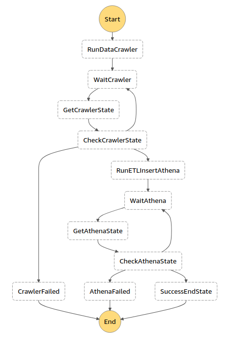

# Serverless data pipelines - Batch processing
This is an implementation of the batch processing state machine for the serverless data pipeline for Flanders traffic analysis.
See [becloudway/serverless-data-pipelines](https://github.com/becloudway/serverless-data-pipeline) for more information on the general scope of the project.

# Architecture

The state machine consists of 4 tasks (RunDataCrawler, GetCrawlerState, RunETLInsertAthena and CheckAthenaState), 
combined with wait and choice states.

#### RunDataCrawler
Runs the data crawler that explores the event history data contained in the delivery bucket.

#### GetCrawlerState
Gets the state of the data crawler in order to be able to check that the state of the crawler is 'SUCCEEDED' before 
moving on to the execution of the Athena ETL query.

#### RunETLInsertAthena
Runs the Athena ETL insert queries, which perform the following:
* Computation of aggregate values and derived fields
* Selection of relevant information
* Grouping of locations by lve_nr (natural grouping, e.g. a set of lanes on the same road)
* Repartitioning of data by event time (year, month, day)

#### GetAthenaState
Gets the states of the executed Athena queries in order to be able to check that all queries succeeded.

# Instruction
When MFA is enabled for the current AWS account, the following variables have to be exported for correct authorization 
before running a cli command: `AWS_ACCESS_KEY_ID`, `AWS_SECRET_ACCESS_KEY`, `AWS_SESSION_TOKEN`. These variables can be 
obtained with the command `aws sts get-session-token --serial-number <account-arn> --token-code <mfa-code>`. 
A bash script `mfa.sh` is provided which automates this process. This script requires the library `jq` to be installed,
which is used to parse the returned json from the get-session-token command. Also make sure to replace the arn variable
with your own account arn. The script can be used as follows: `./mfa.sh "<cli-command>" <mfa-code>`.

# Data
The Athena ETL queries process the historical event data that is contained within the S3 delivery bucket.
This is what the processed data looks like (special thanks to [convertcsv.com](https://www.convertcsv.com/csv-to-markdown.htm)):

|uniqueid|recordtimestamp|currentspeed|bezettingsgraad|previousspeed|trafficjamindicator|trafficjamindicatorlong|trafficintensityclass2|trafficintensityclass3|trafficintensityclass4|trafficintensityclass5|speeddiffindicator|avgspeed3minutes|avgspeed20minutes|year|month|day|hour|
|--------|---------------|------------|---------------|-------------|-------------------|-----------------------|----------------------|----------------------|----------------------|----------------------|------------------|----------------|-----------------|----|-----|---|----|
|3159    |1594702800     |97.0        |12             |92.0         |0                  |0                      |4                     |2                     |1                     |5                     |0                 |94.5            |97.75            |2020|7    |14 |5   |
|3159    |1594702860     |83.0        |14             |97.0         |0                  |0                      |4                     |1                     |2                     |7                     |0                 |90.0            |96.95            |2020|7    |14 |5   |
|3159    |1594702920     |96.0        |15             |83.0         |0                  |0                      |7                     |1                     |0                     |7                     |0                 |89.5            |96.6             |2020|7    |14 |5   |
|3159    |1594702980     |94.0        |14             |96.0         |0                  |0                      |6                     |4                     |1                     |3                     |0                 |95.0            |95.7             |2020|7    |14 |5   |
|3159    |1594703040     |86.0        |13             |94.0         |0                  |0                      |5                     |1                     |2                     |5                     |0                 |90.0            |94.9             |2020|7    |14 |5   |
|3159    |1594703100     |94.0        |14             |86.0         |0                  |0                      |6                     |2                     |3                     |3                     |0                 |90.0            |94.9             |2020|7    |14 |5   |
|3159    |1594703160     |99.0        |13             |94.0         |0                  |0                      |7                     |0                     |2                     |4                     |0                 |96.5            |95.05            |2020|7    |14 |5   |

The processed data contains useful information for visualizations (in e.g. Quicksight).

#### Field definitions
* *uniqueid*: unique id of the location of the measurement
* *recordtimestamp*: unix timestamp (in seconds since epoch) of the measurement
* *bezettingsgraad*: number of vehicles of all vehicle classes that passed during the measurement period (60 seconds)
* *trafficintensityclass2*: number of passing vehicles of vehicle class 2 during the measurement period
* *trafficintensityclass3*: number of passing vehicles of vehicle class 3 during the measurement period
* *trafficintensityclass4*: number of passing vehicles of vehicle class 4 during the measurement period
* *trafficintensityclass5*: number of passing vehicles of vehicle class 5 during the measurement period
* *currentspeed*: average speed of all vehicle classes (NULL if no vehicles have passed)
* *previousspeed*: currentspeed of the previous measurement period
* *speeddiffindicator*: 1 if speeddiff is greater than or equal to 20, -1 if speeddiff is less than or equal to -20, 0 otherwise
* *avgspeed3minutes*: average of currentspeed of current measurement and currentspeed of previous measurement (NULL values not included in average)
* *avgspeed20minutes*: average of currentspeed of current measurement and currentspeed of 19 previous measurements (NULL values not included in average)
* *trafficjamindicator*: 1 if avgspeed2minutes is less than 40, 0 if avgspeed2minutes is less than 250, -1 otherwise
* *trafficjamindicatorlong*: same as trafficjamindicator, but for avgspeed20minutes
* *year*: year derived from the record timestamp
* *month*: month derived from the record timestamp
* *day*: day derived from the record timestamp
* *hour*: hour derived from the record timestamp